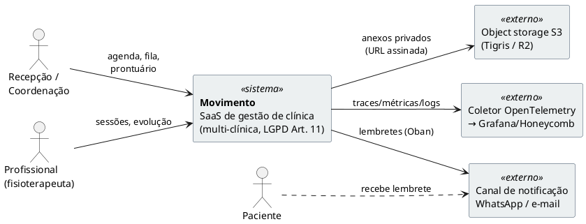
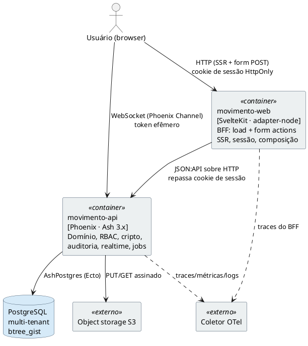

# Arquitetura de Sistema

Como as peças se encaixam, quem fala com quem, e quais são os contratos.
Decisões que justificam este desenho: [00-decisoes.md](00-decisoes.md).

> **Nota de verificação.** Este documento passou por revisão crítica. Cada citação de
> linha do protótipo (`interface/Movimento.dc.html`) foi conferida com `sed`/`grep`
> antes de ser escrita — o registro do que mudou está na seção final,
> [§14 Correções desta revisão](#14-correções-desta-revisão). Snippets de API de
> bibliotecas que ainda não pudemos confirmar contra o hexdocs (não há projeto Elixir
> neste repo ainda) estão marcados com `# NAO-VERIFICADO`.

---

## 1. Visão geral

```
                    ┌──────────────────────────────────────┐
                    │             Navegador                │
                    │  Svelte 5 (runes) · TS               │
                    └───────┬───────────────────┬──────────┘
                            │ HTTP (SSR + form) │ WebSocket
                            │  cookie de sessão │  token efêmero
                            ▼                   │
           ┌────────────────────────────┐       │
           │      movimento-web         │       │
           │  SvelteKit · adapter-node  │       │
           │  BFF: load + form actions  │       │
           │  NÃO tem conexão de banco  │       │
           └────────────┬───────────────┘       │
                        │ JSON:API              │
                        │ Bearer (service)      │
                        ▼                       ▼
           ┌──────────────────────────────────────────────┐
           │             movimento-api                    │
           │  Phoenix · Ash 3.x                           │
           │  ├─ AshJsonApi        (REST)                 │
           │  ├─ Phoenix.Channel   (realtime)             │
           │  ├─ Ash.Policy        (RBAC + field policies)│
           │  ├─ AshCloak          (cripto de campo)      │
           │  ├─ AshPaperTrail     (auditoria LGPD)       │
           │  └─ Oban              (jobs)                 │
           └───────┬──────────────────────┬───────────────┘
                   │ AshPostgres          │ S3 API
                   ▼                      ▼
          ┌─────────────────┐   ┌────────────────────┐
          │   PostgreSQL    │   │  Object storage    │
          │  multi-tenant   │   │  anexos (privado,  │
          │  + btree_gist   │   │  URL assinada)     │
          └─────────────────┘   └────────────────────┘

         Tudo instrumentado com OpenTelemetry → coletor → backend
```

**Duas regras invioláveis.**
O `movimento-web` nunca abre conexão com o Postgres — toda autorização acontece num lugar só, dentro do Ash (ADR-005).
Nenhum módulo de domínio lê o relógio do sistema; o tempo é injetado (ADR-009).

---

## 2. Fronteiras e responsabilidades

### `movimento-api` (Elixir · Phoenix · Ash)

Dono de: modelo de domínio, regras de negócio, autorização, criptografia, auditoria, agregados, jobs e o barramento de eventos em tempo real.

Os quatro motores de regra do protótipo (ADR-001) são código de domínio puro e testável, **não** resource actions inchadas. Três vêm para o servidor; um fica no cliente:

| Motor | Origem no protótipo | Onde vive |
|---|---|---|
| `dayPeriods` — disponibilidade por precedência de 4 camadas | [`:854`](../interface/Movimento.dc.html#L854) | `Movimento.Scheduling.Availability` (servidor) |
| `futureConflicts` — impacto retroativo de mudança de horário | [`:864`](../interface/Movimento.dc.html#L864) | `Movimento.Scheduling.ImpactAnalysis` (servidor) |
| `filaVagas` — busca de vagas na fila | [`:2531`](../interface/Movimento.dc.html#L2531) | `Movimento.Waitlist.SlotFinder` (servidor) |
| `layoutAppts` — coloração de grafo de intervalos p/ raias | [`:1576`](../interface/Movimento.dc.html#L1576) | função pura **no cliente** |

As **4 camadas de precedência** do `dayPeriods` ([`:854`](../interface/Movimento.dc.html#L854)) valem a pena registrar, porque a ordem é regra de negócio, não detalhe: (1) exceção de data da clínica que não seja `'horario'` fecha o dia para todos; (2) exceção do profissional na data (folga ou horário pontual) sobrepõe tudo abaixo; (3) horário especial da clínica na data; (4) horário semanal do profissional — que por sua vez pode "seguir a clínica" (`followClinic`) ou ter grade própria, resolvido em `profWeek` ([`:840`](../interface/Movimento.dc.html#L840)).

Além desses quatro, `computeSerie` ([`:1081`](../interface/Movimento.dc.html#L1081)) — geração da série de sessões de um pacote, pulando feriados e opcionalmente a data-âncora — é lógica de domínio de peso equivalente e mora em `Movimento.Packages.Series`.

Cada motor é um módulo com funções puras que recebem dados **e o relógio** (ADR-009), testadas isoladamente. As resource actions do Ash apenas os orquestram dentro da transação.

### `movimento-web` (Node · SvelteKit)

Dono de: SSR, roteamento, composição de tela, estado de UI, e as interações ricas (drag-and-drop, pan, raias da agenda, scroll-spy). Traduz sessão em chamadas autenticadas à API. Não tem regra de negócio — quando precisa decidir, pergunta.

`layoutAppts` fica aqui por ser puramente visual: é uma coloração de grafo de intervalos (atribuir cada agendamento a uma "raia" horizontal sem que dois que se sobrepõem no tempo caiam na mesma raia), depende só do que já está na tela e não tem consequência de negócio. A fronteira exata entre "regra que o front espelha" e "regra que só o servidor decide" está em [§10](#10-fronteira-espelho-do-cliente-vs-autoridade-do-servidor).

---

## 3. Diagramas C4

Renderizáveis com PlantUML. Usamos sintaxe base de `rectangle`/`component` (sem depender do include externo `C4-PlantUML`, que pode não resolver offline); os estereótipos indicam o nível C4.

### 3.1 Nível 1 — Contexto



### 3.2 Nível 2 — Contêineres



O detalhe importante do nível 2: existem **dois** caminhos do browser ao backend. O de dados passa pelo BFF (que porta o cookie e aplica composição/cache); o de tempo real é uma conexão WebSocket direta do browser ao Phoenix (ADR-004/ADR-005), autenticada por token efêmero — ver [§5](#5-autenticação).

---

## 4. Contrato de API

**JSON:API** via AshJsonApi. Rotas derivadas dos recursos, com `include` para carregar relacionamentos aninhados.

```
GET    /api/appointments?filter[date][gte]=2026-07-09&filter[date][lte]=2026-07-09
         &include=professional,appointment_type,attendances.patient
POST   /api/appointments                    # ação :schedule
PATCH  /api/appointments/:id/reschedule     # ação :reschedule
PATCH  /api/appointments/:id/complete       # ação :mark_completed
PATCH  /api/appointments/:id/no_show        # ação :mark_no_show
POST   /api/packages                        # ação :create_with_series
POST   /api/waitlist/:id/offer              # cria hold (ver §6)
GET    /api/availability?professional_id&date_from&date_to
```

Três características não-negociáveis do contrato:

**Ações são nomeadas, não CRUD.** `PATCH /appointments/:id` genérico não existe. Cada transição tem sua rota, porque cada uma tem policy, validação e efeito colateral distintos — marcar falta debita sessão de pacote, marcar concluído também, cancelar não.

**O tenant nunca vem do cliente.** É resolvido a partir da sessão, no `Ash.Scope`. Um `clinic_id` no corpo da requisição é ignorado ou rejeitado, jamais confiado.

**Erros carregam campo.** O objetivo é que o form action do SvelteKit consiga mapear cada erro de volta para o input certo. O JSON:API define objetos de erro com `source/pointer` justamente para isso, e a expectativa é que o AshJsonApi emita `source.pointer` (ou `source.parameter`) para erros de validação que tenham `field`/`fields`.

> `# NAO-VERIFICADO: confirmar contra hexdocs ao scaffoldar` — precisa-se confirmar
> que o AshJsonApi serializa `Ash.Error.Invalid` populando `source.pointer` a partir
> do `field` do erro, e qual o formato exato do ponteiro (`/data/attributes/<campo>`).
> A afirmação anterior deste documento tratava isso como fato; rebaixado a hipótese
> até verificação. O comportamento análogo do `AshPhoenix.Form` (erro só aparece se
> implementa `AshPhoenix.FormData.Error` e tem `field`/`fields`) está documentado em
> `.claude/rules/ash_phoenix.md` e é a base da expectativa.

A consequência prática independe da verificação: **erros sem campo existem e são comuns neste domínio** — conflito de agenda, turma cheia, versão obsoleta não pertencem a nenhum input. O front precisa de um canal de erro global (flash/banner no topo do formulário), não só de inputs vermelhos. Ver [§8](#8-resiliência-e-degradação) para o mapeamento de códigos.

---

## 5. Autenticação

`AshAuthentication` com sessão por cookie (`HttpOnly`, `Secure`, `SameSite=Lax`). **Sem senha** (ADR-015): as estratégias são **Google OAuth** e **Magic Link**. O BFF do SvelteKit repassa o cookie nas chamadas server-to-server. Para o WebSocket, o BFF emite um **token efêmero de curta duração** (Phoenix.Token, minutos), entregue ao cliente no `load` — o cookie de sessão nunca vai para o JS.

**Identidade global multi-tenant (ADR-014).** O `User` é global e pode ter vários `Membership`s; a sessão guarda o **tenant ativo**, e `actor.papel`/`actor.professional_id` derivam do `Membership` ativo. Trocar de clínica (`POST /auth/switch-tenant`, [09 §8](09-contrato-api.md)) troca o tenant ativo e **reemite** o token de WS.

```elixir
# NAO-VERIFICADO: confirmar contra hexdocs ao scaffoldar
# Emissão do token efêmero no BFF (via um endpoint do Phoenix) e verificação no socket:
#   Phoenix.Token.sign(MovimentoWeb.Endpoint, "ws auth", %{user_id: id, clinic_id: active_cid})
#   Phoenix.Token.verify(socket, "ws auth", token, max_age: 300)
```

O token carrega `user_id` **e** o `clinic_id` **ativo**; o `connect/3` do socket rejeita se o tenant do token não bate com o que o Channel tenta assinar. Isso fecha a porta de um cliente autenticado numa clínica escutar tópico de outra — inclusive uma outra clínica **do mesmo usuário** que não seja a ativa.

---

## 6. Tempo real

Ash emite notificações em toda mutação. Um `Ash.Notifier` publica no `Phoenix.PubSub`; os Channels reenviam ao cliente.

### 6.1 Granularidade de tópico — e por que ela muda com a visão

O desenho ingênuo "um tópico por dia" quebra nas visões semana e mês, que abrangem muitos dias. Um cliente na visão mês precisaria assinar ~35–42 tópicos e re-assinar a cada navegação. Resolvemos com **tópicos em duas resoluções**, escolhidos pela visão ativa:

```
clinic:<clinic_id>:agenda:<YYYY-MM-DD>    # visões dia e semana — payload cheio
clinic:<clinic_id>:agenda:month:<YYYY-MM> # visão mês — só sinal leve de invalidação
clinic:<clinic_id>:waitlist               # fila de espera + holds
clinic:<clinic_id>:presence               # quem está olhando o quê
```

- **Visão dia:** assina 1 tópico de dia. Recebe eventos semânticos completos e aplica patch.
- **Visão semana:** assina os 5–7 tópicos dos dias visíveis. Sete assinaturas é barato; o fan-out continua proporcional a quem olha os mesmos dias.
- **Visão mês:** assina **1** tópico de mês. As células do mês mostram densidade/contagem, não blocos — então o payload é um sinal leve `{day: "2026-07-14", change: :count}` e a UI recarrega só a contagem daquele dia (ou marca "atualizado"), sem transportar agendamentos inteiros que não caberiam na célula.

O publicador (o `Ash.Notifier`) faz, em toda mutação de agendamento, **dois** `broadcast`: um no tópico do dia (evento cheio) e um no tópico do mês (sinal leve). Dois publishes por escrita é irrelevante em custo; o que escala mal é o número de assinantes por tópico, e esse continua limitado a "pessoas olhando o mesmo recorte".

```elixir
# NAO-VERIFICADO: confirmar contra hexdocs ao scaffoldar
# Ash.Notifier.PubSub permite templates de tópico a partir de campos do recurso;
# um notifier custom pode derivar tanto o tópico do dia quanto o do mês a partir de :date.
```

### 6.2 Payload

Evento semântico com o recurso já serializado, não um "invalide tudo":

```elixir
%{event: "appointment_rescheduled",
  appointment: %{id: ..., start: ..., professional_id: ..., version: 7},
  actor: %{id: ..., nome: "Aline"}}
```

O cliente aplica o patch no store de runes. Se o evento chega para um recurso que ele não tem, ignora. `invalidate()` do SvelteKit fica como fallback quando o patch não é aplicável — e é também o mecanismo de re-sincronização após reconexão ([§8](#8-resiliência-e-degradação)).

### 6.3 Presence

`Phoenix.Presence` no tópico da agenda mostra quem mais está no mesmo dia. Barato de ligar, e evita metade dos conflitos por simplesmente tornar visível que outra pessoa está lá.

---

## 7. Concorrência: as duas corridas reais

O protótipo tem duas condições de corrida que só aparecem com mais de um usuário. Ambas são requisito de v1.

### 7.1 A garantia final de não-sobreposição (exclusion constraint)

O detector `checkConflict` do protótipo ([`:834`](../interface/Movimento.dc.html#L834)) roda em memória sobre a lista do dia carregado. No servidor, a validação Ash dá a mensagem bonita, mas a **garantia** de que dois agendamentos do mesmo profissional não se sobrepõem é uma *exclusion constraint* no Postgres — a única coisa que sobrevive a duas transações concorrentes.

O detalhe que a versão anterior deste documento tratou como trivial ("com exceção para encaixe") não é trivial e merece o DDL real. O protótipo define o **encaixe** como uma sobreposição *deliberada*: `checkConflict` retorna `null` imediatamente se o novo agendamento é encaixe (`if(encaixe) return null;`, [`:835`](../interface/Movimento.dc.html#L835)) **e** ignora agendamentos encaixe existentes na busca (`!b.encaixe`, [`:837`](../interface/Movimento.dc.html#L837)). A UI confirma a intenção: "Marque 'Encaixe' para exceder a capacidade" ([`:1997`](../interface/Movimento.dc.html#L1997)), e o próprio seed cria um encaixe que sobrepõe outro de propósito ([`:157`](../interface/Movimento.dc.html#L157)).

Como se "exclui parcialmente" uma exclusion constraint? Com um **predicado `WHERE` na constraint** — uma exclusion constraint parcial. Linhas que não satisfazem o predicado simplesmente não entram no índice: não disparam a exclusão nem são excluídas por ninguém. É exatamente a semântica do encaixe.

```sql
-- pré-requisito: o operador de igualdade em UUID dentro de um índice GiST
CREATE EXTENSION IF NOT EXISTS btree_gist;

ALTER TABLE appointments
  ADD CONSTRAINT appointments_no_overlap
  EXCLUDE USING gist (
    professional_id                        WITH =,
    tstzrange(starts_at, ends_at, '[)')    WITH &&
  )
  WHERE (encaixe = false AND status <> 'cancelado');
```

Leitura da constraint: para o par de linhas em que **ambas** têm `encaixe = false` e `status <> 'cancelado'`, é proibido que tenham o mesmo `professional_id` e intervalos que se toquem (`&&`) no meio-aberto `[)` (dois blocos adjacentes, um terminando 10:00 e outro começando 10:00, **não** conflitam). Uma linha de encaixe, ou uma cancelada, está fora do índice — pode sobrepor à vontade, e nada colide com ela. Isso reproduz `checkConflict` fielmente, agora com garantia transacional.

**Interação com a tenancy (ADR-017).** A estratégia é **por atributo** (`strategy :attribute`, coluna `clinic_id`, [ADR-017](00-decisoes.md)): `appointments` é **uma tabela única**. Ainda assim a constraint **não** precisa carregar `clinic_id`, porque `Professional` é por-tenant e **`professional_id` é único globalmente** — dois agendamentos de clínicas diferentes têm `professional_id` diferente, então a não-sobreposição por `professional_id` já é por-clínica. Adicionar `clinic_id WITH =` à exclusion constraint é **defesa-em-profundidade opcional** (protege contra um bug que reutilizasse `professional_id`), não requisito de correção. Um `Professional` que atende em duas clínicas tem **dois** registros (dois `professional_id`), um por `clinic_id`.

A validação Ash correspondente deve ser marcada como possivelmente atômica para casar com a operação de banco, mas ela é redundante para a *garantia* — sua função é a mensagem de erro por campo. A constraint é a verdade.

### 7.2 Reserva de vaga na fila (`hold`) — e por que `now()` não pode entrar na constraint

Hoje, `offerVaga` ([`:2596`](../interface/Movimento.dc.html#L2596)) só pré-preenche um modal (`openModal('novoAgendamento', …)`). Entre oferecer a vaga e confirmar o `createAppt` não existe reserva: dois atendentes podem oferecer o mesmo horário ao mesmo tempo, e o segundo vence ou colide sem aviso.

Correção: `POST /api/waitlist/:id/offer` cria um recurso **`SlotHold`** com TTL curto (5 min). A não-sobreposição de holds do mesmo profissional é outra exclusion constraint:

```sql
ALTER TABLE slot_holds
  ADD CONSTRAINT slot_holds_no_overlap
  EXCLUDE USING gist (
    professional_id                     WITH =,
    tstzrange(starts_at, ends_at, '[)') WITH &&
  );
```

A versão anterior propunha filtrar essa constraint por `WHERE expires_at > now()` para "ignorar" holds expirados. **Isso é inválido em Postgres.** O predicado de uma exclusion constraint (como o de um índice parcial) precisa ser *imutável*, e `now()` é `STABLE`, não `IMMUTABLE` — o Postgres recusa a criação da constraint. Além disso, a semântica seria errada mesmo se aceitasse: o predicado é avaliado no momento do `INSERT`, não continuamente, então "expirou" nunca se propagaria sozinho.

Desenho correto — a expiração vive na **DML**, nunca na constraint:

1. A constraint acima cobre **todos** os holds vivos, sem predicado de tempo.
2. A ação `:offer`, dentro da mesma transação, **antes** de inserir, remove holds já vencidos do profissional: `DELETE FROM slot_holds WHERE professional_id = $1 AND expires_at <= now()`. Em DML, `now()` é perfeitamente válido. Isso fecha deterministicamente a janela entre "expirou" e "o coletor apagou": o próprio ato de tentar reservar limpa o que venceu.
3. Um job Oban (cron, 1 min) é backstop de limpeza, para holds de profissionais que ninguém tentou reservar. Não é o que garante correção — é higiene.

O segundo atendente recebe então `409 Conflict` imediato, com o nome de quem segurou. Um hold que venceu 30s atrás não bloqueia, porque o passo (2) o apaga antes de checar a constraint.

```elixir
# NAO-VERIFICADO: confirmar contra hexdocs ao scaffoldar
# O DELETE de holds vencidos deve rodar dentro da transação da ação :offer,
# via before_action que executa um bulk destroy filtrado por expires_at <= now(),
# ou uma instrução SQL crua no repo. Confirmar a API de bulk destroy do Ash 3.x
# (Ash.bulk_destroy / query com filtro) e se ela participa da transação da ação.
```

### 7.3 Remarcação simultânea (locking otimista)

Dois usuários arrastam o mesmo bloco. Cada `Appointment` carrega `version` (inteiro). `PATCH .../reschedule` exige a versão lida; divergiu, retorna `409` com o estado atual, e a UI mostra "Aline moveu este agendamento enquanto você editava" em vez de sobrescrever silenciosamente.

Duas perguntas legítimas: **quem incrementa `version`?** e **o Ash tem isso pronto?** O padrão de locking otimista — ler a versão atual, adicionar um filtro na atualização exigindo que a versão não tenha mudado, e incrementá-la atomicamente na mesma escrita — é conhecido e o Ash tem um mecanismo de primeira classe para ele. A aplicação **não** incrementa `version` à mão numa `change set_attribute`; isso reintroduziria a corrida. O mecanismo built-in faz o incremento e o filtro atomicamente, e falha com um erro de "registro obsoleto" quando a versão lida não bate — que o AshJsonApi mapeia para `409 Conflict`.

```elixir
# NAO-VERIFICADO: confirmar contra hexdocs ao scaffoldar
# Ash expõe um change built-in de optimistic lock (algo como `optimistic_lock(:version)`)
# que, na ação de update, adiciona o filtro de versão e incrementa o atributo atomicamente,
# levantando Ash.Error.Changes.StaleRecord (nome a confirmar) em divergência.
# Confirmar: (a) o nome exato do change built-in; (b) a classe/módulo exato do erro;
# (c) que o AshJsonApi traduz esse erro para 409 e não 422.
actions do
  update :reschedule do
    accept [:starts_at, :ends_at]
    # change optimistic_lock(:version)   # ver nota acima
  end
end
```

O atributo `version` é um `integer` com default `1`. Como a exclusion constraint de [§7.1](#71-a-garantia-final-de-não-sobreposição-exclusion-constraint) e o locking otimista atacam problemas diferentes (sobreposição entre agendamentos *distintos* vs. edição concorrente do *mesmo* agendamento), os dois coexistem e nenhum torna o outro dispensável.

---

## 8. Resiliência e degradação

O ponto sensível do desenho BFF: o `movimento-web` faz SSR chamando a API por rede. O que acontece quando a API cai no meio de um SSR, ou o WebSocket morre?

**SSR com a API indisponível.** Um `load` do SvelteKit que recebe timeout/`5xx` da API **não** deve renderizar tela vazia nem mascarar o erro. Distinguimos por tipo de rota:

- **Navegação de leitura** (abrir a agenda): o `load` traduz a falha num `error(503, …)` do SvelteKit e a página cai num `+error.svelte` claro ("Não foi possível carregar a agenda — tentando novamente"), com retry automático curto. Nunca serve dado inventado.
- **Form action de escrita** (marcar concluído, remarcar): falha **fecha** — jamais confirma otimisticamente no servidor. O action retorna `fail(status, {erro})` e a UI mantém o estado anterior com aviso. Confirmar uma sessão que na verdade não gravou é pior que um erro visível, sobretudo com débito de pacote no meio.

**Mapeamento de códigos** (o contrato de erro que a UI conhece):

| Código | Origem | UI |
|---|---|---|
| `409` | exclusion constraint / hold / versão obsoleta | banner: "outra pessoa alterou — veja o estado atual" + refetch |
| `422` | validação de campo (`Ash.Error.Invalid` com field) | input vermelho (ver [§4](#4-contrato-de-api)) |
| `403` | policy / field policy | esconder ação; se chegou por URL, tela de acesso negado |
| `503`/timeout | API fora / lenta | erro de página (leitura) ou fail fechado (escrita) |

**Reconexão do WebSocket.** O cliente `phoenix` reconecta sozinho com backoff. Channels **não** reproduzem eventos perdidos durante a queda — então, ao re-entrar num tópico, o cliente **não** pode assumir que seu store está fresco. O handler de rejoin dispara um `invalidate()`/refetch do recorte visível, tratando o realtime como otimização sobre um estado que a qualquer momento pode ser reconciliado por uma leitura autoritativa. Isso torna a perda de eventos um problema de latência, não de correção.

**Idempotência.** Ações de escrita disparadas por retry (usuário clica de novo após timeout) precisam ser seguras. Transições nomeadas ajudam: remarcar para o mesmo horário duas vezes é inócuo; marcar concluído duas vezes deve ser idempotente na ação (checar o status atual antes de debitar pacote). Um `Idempotency-Key` por submissão de form é o mecanismo de reserva para as ações com efeito colateral financeiro/de pacote — detalhar quando o faturamento entrar (ADR em aberto).

---

## 9. Estratégia de cache

Três camadas, com regras distintas por sensibilidade do dado:

- **Dados de referência, mutação rara** (profissionais, tipos de atendimento, horário e feriados da clínica): o BFF cacheia em memória por processo com TTL curto (30–60 s) **e** invalidação empurrada — os mesmos tópicos PubSub de [§6](#6-tempo-real) sinalizam quando `hours`/`profs` mudam, e o BFF derruba a entrada. Barato e corta a maior parte do fan-out de leitura no SSR.
- **Dados de agenda, tempo real** (agendamentos, holds, fila): **não** são cacheados no BFF. São a razão de existir o realtime; servir agenda velha reintroduz exatamente as corridas de [§7](#7-concorrência-as-duas-corridas-reais). O BFF busca por request e o cliente mantém frescor por Channel.
- **Anexos (dado de saúde, ADR-007):** o binário fica em object storage privado; a API emite **URL assinada de vida curta** por acesso. A URL **nunca** é cacheada, nem em CDN, nem no BFF, nem em `localStorage`. O que pode ser cacheado é o metadado do anexo (nome, tipo, data), não o conteúdo nem o link.

Regra transversal: nada que seja categoria especial de LGPD entra em cache compartilhado entre requisições ou entre usuários. Cache de referência é por-processo e sem PII.

---

## 10. Fronteira: espelho do cliente vs. autoridade do servidor

A "exceção pragmática" — o front espelhar regras para feedback imediato — precisa de uma linha nítida, senão vira lógica de negócio duplicada e divergente. A regra é: **o cliente pode espelhar uma decisão apenas quando tem em mãos todos os dados de que ela depende, e o resultado é sempre um palpite que o servidor reconfirma.**

**Pode ser espelhado no cliente** (feedback imediato, não-autoritativo):

| Regra | Por que é seguro espelhar |
|---|---|
| `layoutAppts` ([`:1576`](../interface/Movimento.dc.html#L1576)) | Puramente visual; depende só do que está na tela; sem consequência de negócio. |
| Sombreamento de disponibilidade (`dayPeriods`, [`:854`](../interface/Movimento.dc.html#L854)) | O front carrega os períodos do dia visível; pode acender vermelho um horário fora do expediente antes do round-trip. |
| Prévia da série (`computeSerie`, [`:1081`](../interface/Movimento.dc.html#L1081)) | Mostrar as 10 datas geradas (pulando feriados) antes de submeter é determinístico com os dados locais. |
| Dica de sobreposição (`checkConflict`, [`:834`](../interface/Movimento.dc.html#L834)) no dia carregado | O front tem os blocos do dia; pode alertar "colide com Fulano" instantaneamente. |

**Só o servidor decide** (autoritativo, nunca confiar no cliente):

| Regra | Por que não pode ficar no cliente |
|---|---|
| Garantia de não-sobreposição | Só a exclusion constraint ([§7.1](#71-a-garantia-final-de-não-sobreposição-exclusion-constraint)) sobrevive a duas transações concorrentes; a dica do cliente fica obsoleta no instante em que outro escreve. |
| Reserva de vaga / TTL do hold | Corrida entre atendentes ([§7.2](#72-reserva-de-vaga-na-fila-hold--e-por-que-now-não-pode-entrar-na-constraint)); o cliente não tem como reservar átomo nenhum. |
| Versão / locking otimista | Detecção de edição concorrente ([§7.3](#73-remarcação-simultânea-locking-otimista)) exige o estado central. |
| `futureConflicts` ([`:864`](../interface/Movimento.dc.html#L864)) | Varre **todos** os agendamentos futuros ativos para achar os que deixam de caber após uma mudança de horário; o front só tem o recorte visível, então **não pode** espelhar — esta roda no servidor e volta como lista. É o caso que distingue "front tem os dados" (espelhável) de "front não tem os dados" (servidor obrigatório). |
| Débito de sessão de pacote, policies, resolução de tenant | Efeito de negócio, autorização e segurança; nunca no cliente. |

Onde houver espelho, a função pura correspondente é validada por **contrato de teste compartilhado** (os mesmos casos de entrada/saída rodam contra a implementação Elixir e a TS), nunca por cópia de código mantida a olho. Um espelho que diverge silenciosamente do servidor é pior que nenhum espelho.

---

## 11. Jobs em background (Oban)

| Job | Gatilho | Por quê |
|---|---|---|
| Expirar `SlotHold` | cron, 1 min | Backstop de limpeza; a correção real é o delete in-transaction ([§7.2](#72-reserva-de-vaga-na-fila-hold--e-por-que-now-não-pode-entrar-na-constraint)) |
| Materializar série de pacote | após `:create_with_series` | Uma série de 10 sessões cria 10 agendamentos; fora da transação de request |
| Lembretes de sessão | cron diário | WhatsApp/e-mail (o protótipo tem um botão fake de confirmação) |
| Reprojetar pacote retomado | após `:resume` | `pkgResume` ([`:561`](../interface/Movimento.dc.html#L561)) apenas tira o `pkgHold` das sessões e as devolve **nas datas originais** — que, após uma pausa longa, caem no passado |
| Snapshot de métricas diárias | cron noturno | Relatórios não varrem a tabela de agendamentos ao vivo |
| Purga LGPD | cron | Retenção e eliminação a pedido do titular (ADR-007) |

---

## 12. Ambientes

| | dev | staging | produção |
|---|---|---|---|
| API | `mix phx.server` | Fly `gru` | Fly `gru` |
| Web | `vite dev` | Fly `gru` | Fly `gru` |
| Postgres | Docker local | Fly Postgres | Fly Postgres + réplica |
| Storage | MinIO | Tigris/R2 | Tigris/R2 |
| Dados | seed derivado do protótipo | **anonimizado** | real |
| Telemetria | console | coletor OTel | coletor OTel |

**Staging nunca recebe cópia de produção.** Dado de saúde não sai do ambiente que o protege (ADR-007). O seed de dev sai do próprio protótipo, cujos dados são sintéticos por construção — o bloco de seed vai de [`:43`](../interface/Movimento.dc.html#L43) (semente do PRNG, `let s=987654321`) a [`:263`](../interface/Movimento.dc.html#L263) (fecho do IIFE de seed), gerado por um PRNG determinístico (`s=(s*1103515245+12345)&0x7fffffff`). Isso nos dá um conjunto de fixtures realista e legalmente inerte, de graça.

---

## 13. O que ainda não está desenhado

Estas peças dependem de respostas de produto ([02-regras-e-lacunas.md](02-regras-e-lacunas.md), Parte 4) e **não** devem ser implementadas por palpite:

- **Salas e equipamentos.** Se existirem, `checkConflict` deixa de ser "por profissional" e vira "por recurso", e a exclusion constraint de [§7.1](#71-a-garantia-final-de-não-sobreposição-exclusion-constraint) ganha uma segunda dimensão (`resource_id WITH =`) ou uma segunda constraint. É a mudança de schema mais cara da lista.
- **Faturamento.** Preço, convênio, guia, repasse. O formulário de profissional já coleta banco, PIX e uma string livre de remuneração ("Ex.: 60/40 por sessão…") que ninguém lê ([`:3140`](../interface/Movimento.dc.html#L3140)). É também o que puxa `Idempotency-Key` obrigatório ([§8](#8-resiliência-e-degradação)).
- **Multi-unidade dentro de uma clínica.** Diferente de multi-clínica: mesma pessoa jurídica, filiais com horários e salas próprios.

---

## 14. Correções desta revisão

Auditoria do documento escrito sem revisão. O que mudou e por quê:

**Citações de linha — todas conferidas, todas corretas.** Verifiquei com `sed`/`grep` cada citação do protótipo do documento original: `dayPeriods` [`:854`], `futureConflicts` [`:864`], `filaVagas` [`:2531`], `layoutAppts` [`:1576`], `computeSerie` [`:1081`], `offerVaga` [`:2596`], `checkConflict` [`:834`], `pkgResume` [`:561`], remuneração [`:3140`], e o intervalo de seed 43–263. **Nenhuma estava errada.** Onde citei linhas novas ([`:835`], [`:837`], [`:157`], [`:840`], [`:1997`]) para sustentar a análise do encaixe, também as verifiquei antes de escrever.

**Exclusion constraint com "exceção para encaixe" — de hand-wave para DDL real ([§7.1](#71-a-garantia-final-de-não-sobreposição-exclusion-constraint)).** A frase original tratava como trivial algo que não é. Confirmei no protótipo que o encaixe é sobreposição *deliberada* nos dois sentidos (`if(encaixe) return null` em [`:835`] e o filtro `!b.encaixe` em [`:837`]) e escrevi a exclusion constraint parcial com predicado `WHERE (encaixe = false AND status <> 'cancelado')`, que é como se "exclui parcialmente" a constraint. Adicionei o pré-requisito `btree_gist` e a interação com a estratégia de tenancy (ADR-003).

**`SlotHold` com `WHERE expires_at > now()` — corrigido, era inválido ([§7.2](#72-reserva-de-vaga-na-fila-hold--e-por-que-now-não-pode-entrar-na-constraint)).** `now()` é `STABLE`, não `IMMUTABLE`; Postgres recusa esse predicado numa exclusion constraint, e a semântica ("expirou sozinho") não existiria mesmo se aceitasse. Substituí por: constraint sem predicado de tempo + `DELETE ... WHERE expires_at <= now()` in-transaction antes do insert (na DML `now()` é válido) + Oban só como backstop.

**`AshJsonApi` serializa `source.pointer` — rebaixado a hipótese ([§4](#4-contrato-de-api)).** Estava como fato; marquei `# NAO-VERIFICADO` porque não há como confirmar contra hexdocs neste repo. A consequência de produto (precisar de canal de erro global para erros sem campo) não depende da verificação e foi mantida.

**Granularidade de tópico PubSub — o desenho quebrava nas visões semana/mês, agora resolvido ([§6.1](#61-granularidade-de-tópico--e-por-que-ela-muda-com-a-visão)).** O `clinic:<id>:agenda:<YYYY-MM-DD>` único forçaria ~42 assinaturas na visão mês. Introduzi um segundo tópico de resolução mensal com payload leve; dia/semana assinam tópicos de dia, mês assina um tópico de mês. O publicador faz dois broadcasts por escrita.

**Locking otimista por `version` — respondido "quem incrementa" e "o Ash tem pronto" ([§7.3](#73-remarcação-simultânea-locking-otimista)).** Deixei explícito que a aplicação **não** incrementa à mão (reintroduz a corrida) e que o Ash tem um change built-in de optimistic lock, marcado `# NAO-VERIFICADO` quanto ao nome exato do change, do erro e do mapeamento para 409.

**Preenchido o que faltava.** Diagramas C4 de contexto e contêiner em PlantUML ([§3](#3-diagramas-c4)); resiliência e degradação, incluindo API fora durante SSR e reconexão de WebSocket sem replay ([§8](#8-resiliência-e-degradação)); estratégia de cache por sensibilidade de dado ([§9](#9-estratégia-de-cache)); e a fronteira explícita entre regra espelhável no cliente e regra só-servidor, com `futureConflicts` como o caso-limite que distingue "front tem os dados" de "front não tem os dados" ([§10](#10-fronteira-espelho-do-cliente-vs-autoridade-do-servidor)).

**Mantido o que estava certo.** Duas-regras-invioláveis, ações nomeadas em vez de CRUD, tenant fora do cliente, autenticação por cookie + token efêmero de WS, payload de evento semântico, tabela de jobs Oban, matriz de ambientes e a seção de pendências de produto — tudo permaneceu, com ajustes de referência cruzada apenas onde uma seção nova tornou a redação mais precisa.
